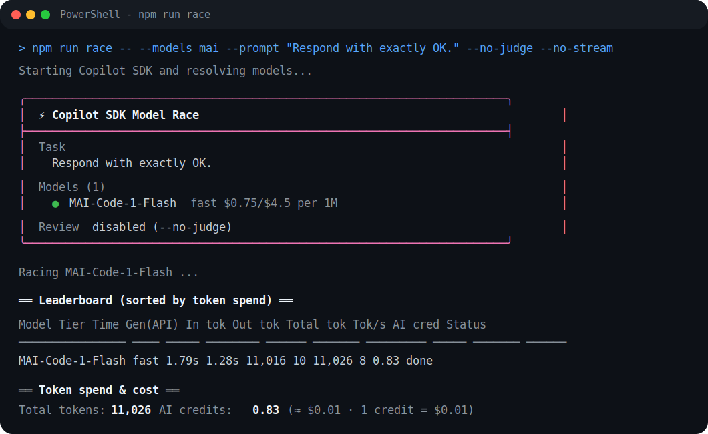

# Model Race

Copilot SDK console app that races multiple models on the same prompt.



## Setup

```powershell
npm install
copilot
```

Requires Node.js, npm, GitHub Copilot CLI, and a signed-in GitHub account with Copilot access/license.

## Run

Interactive setup:

```powershell
npm run race
```

Direct run:

```powershell
npm run race -- --models mai,gpt-5-mini --judge gpt-5.5 --prompt "Write a debounce function in TS"
npm run race -- --models mai,gpt-5-mini --no-judge --prompt "Respond with exactly OK."
```

Sanity tests:

```powershell
npm test
```

## Options

- `models`: contestants to run in parallel. Use fast models for latency/cost tests; mix fast + frontier models for quality comparisons.
- `judge`: optional quality reviewer. Use `--judge gpt-5.5` or `--no-judge`. Judge scores are directional, not a replacement for human review.
- `prompt`: the task every model gets. Good tests: small coding tasks, refactors, debugging, explanations, or edge-case-heavy prompts. Keep prompts precise; long or vague prompts cost more and make scoring noisier.

Notes: tools/file edits are disabled for fairness. Results vary by model availability, account entitlements, network latency, and token usage.

Pricing reference: [GitHub Docs - Models and pricing for GitHub Copilot](https://docs.github.com/en/copilot/reference/copilot-billing/models-and-pricing). If a new model is not in the local pricing table, the app still runs, shows it as `unpriced`/`n/a`, and marks total AI credits as partial.

No user-specific paths, emails, or account IDs are hardwired in the app code - everything runs on the local machine using logged-in credentials.
